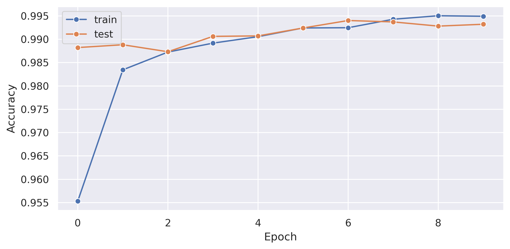
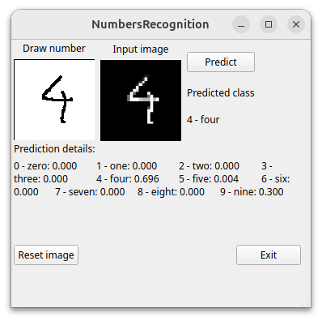

# NumbersRecognition

This repository containst two modules:
- Number Classifier 

    This is an implementation of CNN model trained on MNIST dataset, to classifire images of numbers (0-9)

    

- Application 

    This is an application whitch use Number Classifier module, to recognition number on image, whitch is written by user inside application. Belowe is an example screenshot of application window 

    

## Requirements
- Python 3.x
- NumPy
- OpenCV
- PyTorch
- PyQt5
- Seaborn
- Matplotlib
- Pandas
- tqdm


## Installation
1. Clone the repository:
    ```bash
    git clone https://github.com/kustyk97/NumbersRecognition.git
    ```
2. Navigate to the project directory:
    ```bash
    cd NumbersRecognition
    ```
3. Install the required packages:
    ```bash
    pip install -r requirements.txt
    ```


## Usage
### Application
If you want to run main aplication, you can do this by run the following command:
```bash
python main.py 
    --path_to_model="The path to the model to load."
```
### Train 
You can train your own model, by run the following command:
```bash
python numberClassifier/train.py 
    --path_to_save="The path to save the trained model."
    --batch_size="The batch size to use for training."
    --num_epoch="The number of epochs to train the model."
    --lr="The learning rate to use for training."
```
### Plots
You can plot results of training, by run the following command:
```bash
python plots.py 
```
## License
This project is licensed under the MIT License.